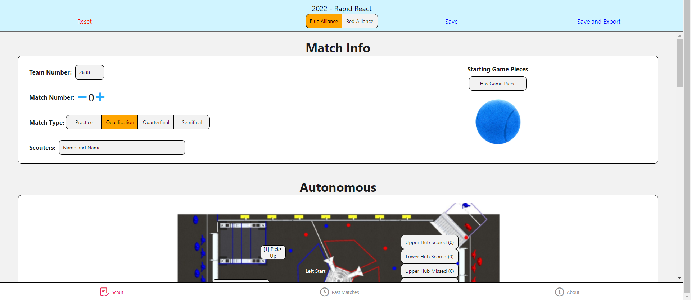
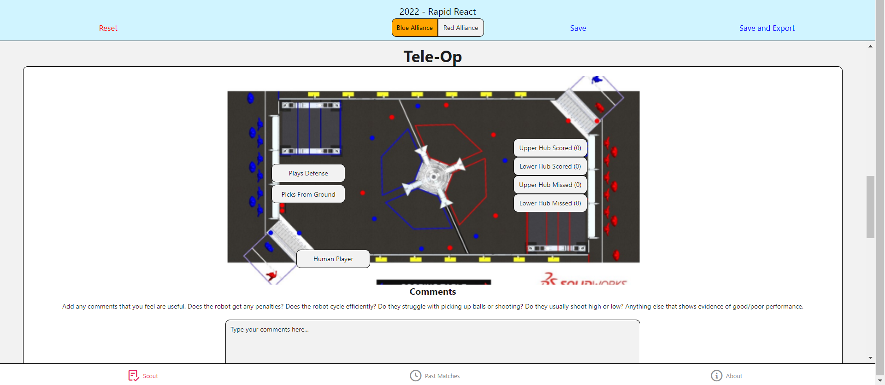
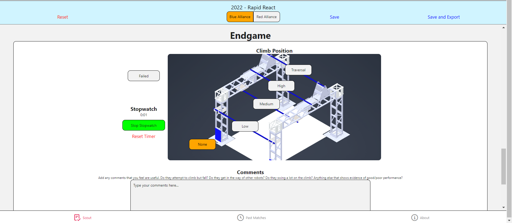
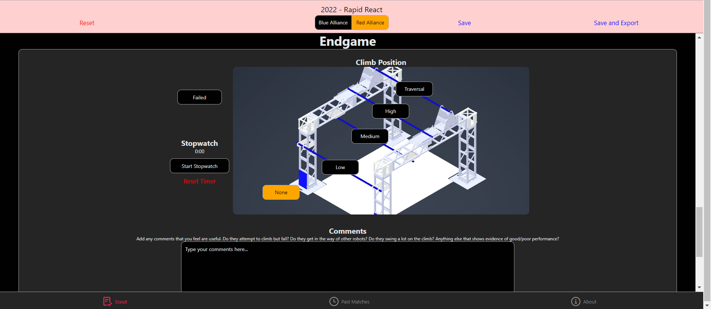
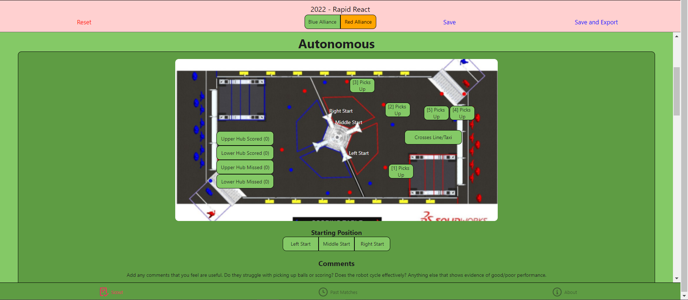

# Scouting App 2023 Edition
#### [Demo](https://patheticmustan.github.io/ScoutingAppWebBuildTest/)
Team 2638's Scouting App for the year 2023 (Charged Up)!

If you have any suggestions or improvements you would like to see in the app, please make an issue in the Github Issues section!

Images

 

## Previous Years
- [Scouting App 2022](https://github.com/PatheticMustan/ScoutingApp2022)
- [Scouting App 2020](https://github.com/PatheticMustan/ScoutingApp2020)
- [Scouting App 2019](https://github.com/PatheticMustan/ScoutingApp2019)

### [Development Quickstart](./docs/Usage.md)
A guide to setting up your development environment.

### [Building](./docs/Building.md)
A guide to how to build the app for web/iOS (still in progress)!!