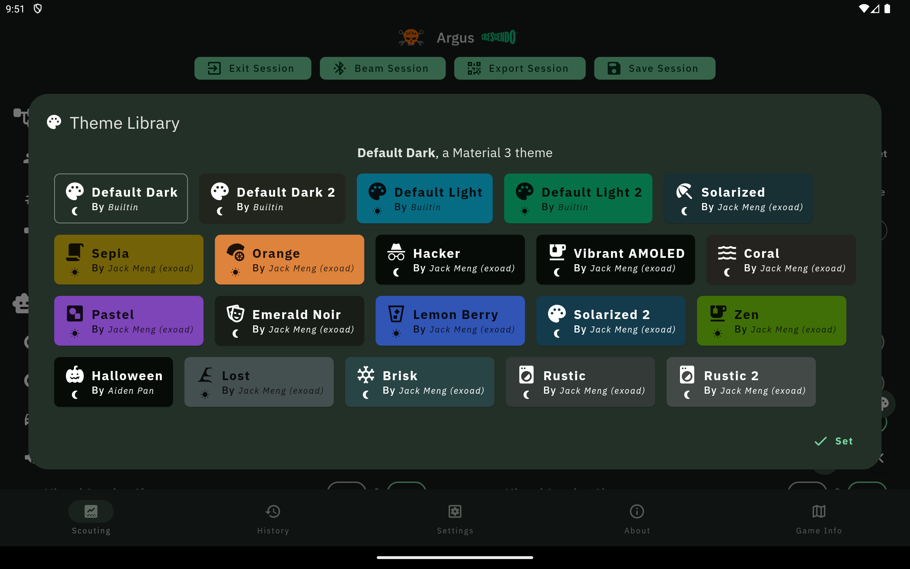

 
<h1>Rebel Robotics Scouting App</h1>
    
<h2><em>Argus</em></h2>
<h3><em>CRESCENDO</em> 2024</h3>

Scouting App for the 2024 year built using the **Flutter Framework**.

    

        <h3>Preview</h3>
    

    
     
    

> **Please note this is a development screenshot!**

## Snapshots

Snapshots are releases & patches of the app.

**Snapshots**
  

[**Apple AppStore**](https://apps.apple.com/us/app/2638-scout/id1460336620)

> [!CAUTION]
> Use snapshot releases at your own risk

**Last Snapshot** 

They can be found under the <a href="https://github.com/rebels2638/ScoutingApp2024/releases"><kbd>Releases</kbd></a> tab and labeled "Snapshot" (aka Preleases).

## Building

**Prerequisite**
* Make sure you have the Flutter SDK downloaded, you can find how to install it for your platform [here](https://docs.flutter.dev/get-started/install)
* If you want to test the App in a mobile environment, make sure you have set up either **Android Studio** or **XCode** for development on those platforms.

1. Clone this repository either through GitHub web or through `git` using `git clone https://github.com/rebels2638/ScoutingApp2024.git`
2. Go into the project folder
3. Run `flutter pub get`
> [!CAUTION]
> Do not run upgrades unless it is for the Flutter framework or Dart framework itself.
4. After pub has cached all of the dependencies, determine the platform you want to build for; here is a list of platforms supported:

**Build for Android** `flutter build apk --release --no-tree-shake-icons` or `flutter build aab --release --no-tree-shake-icons`

**Build for Windows** `flutter build windows --release`

**Build for iOS** `flutter build ipa --release --no-tree-shake-icons`

*Not Supported:* Web,Linux

*Not tested:* OSX

> [!CAUTION]
> These commands will not certify or sign the built binary, so use the respective platform certification program!

## Testing

First, follow the steps in [Building](#building), then just run `flutter run -d [device]`.

`[device]` may vary depending on where you run it. For example, running it directly on a Windows Environment is just `flutter run -d windows`

## Our Team

**Lead Developer**

* Jack Meng ([exoad](https://github.com/exoad))

**Contributors**

* Chiming Wang ([2bf](https://github.com/2bf))
* Richard Xu ([Richard28277](https://github.com/Richard28277))
* Aarav Minocha ([aaravmin](https://github.com/aaravmin))

