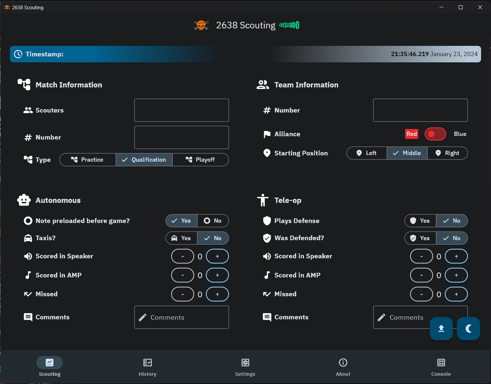

 
<h1>Rebel Robotics Scouting App</h1>
    
<h3><em>CRESCENDO</em> 2024</h3>

Scouting App for the 2024 year built using the **Flutter Framework**.

    

        <h3>Preview</h3>
    

    

> **Please note this is a development screenshot!**

## Snapshot Releases

**Snapshots**

  

Head over to the <a href="https://github.com/rebels2638/ScoutingApp/actions"><kbd>**Actions**</kbd></a> tab and download from any of the target platforms on there.

## Building

**Prerequisite**
* Make sure you have the Flutter SDK downloaded, you can find how to install it for your platform [here](https://docs.flutter.dev/get-started/install)
* If you want to test the App in a mobile environment, make sure you have set up either **Android Studio** or **XCode** for development on those platforms.

> [!WARNING]
> Building for web is not supported

1. Clone this repository either through GitHub or using `git clone https://github.com/rebels2638/ScoutingApp2024.git`
2. Open directory in terminal/CLI: `cd ScoutingApp2024`
3. Download libraries/dependencies: `flutter pub get` (you can also run [`scripts/mac-flutter-start.sh`](./scripts/mac-flutter-start.sh) or [`scripts/windows-flutter-start.bat`](./scripts/windows-flutter-start.bat))
> [!WARNING]
> If Flutter prompts you with an upgrade notification, please run the respective upgrade command: `flutter upgrade`
4. Run `flutter build [platform]` to build for the desired platform (e.g. `windows`).

If you would like to build for a different platform like iOS, please make sure you meet the prerequisites for that platform. For example, to test on iOS, you need XCode on an Apple device. For more information, check https://docs.flutter.dev/platform-integration

## Testing

First, follow the steps in [Building](#building), then just run `flutter run -d [device]`.

`[device]` may vary depending on where you are going to run it. For example running it directly on a Windows Environment is just `flutter run -d windows`

## Our Team

**Lead Developer**

* Jack Meng ([exoad](https://github.com/exoad))

**Developers**

* Chiming Wang ([2bf](https://github.com/2bf))
* Richard Xu ([Richard28277](https://github.com/Richard28277))

**Helpers**

* Aiden Pan
* Aarav Minocha

## Building Remarks

* [`/web/`](./web/) - Please reserve for development purposes only.
* [`/legals/`](/legals/) - Do not modify unless you know what you are doing. This directory preserves external licenses that cannot be tracked by pub.
* [`/repo/`](./repo/) - Strictly for the repository's display purposes, should NOT be linked to the base app in any way

## Resources

**Flutter & Dart**

1. [flutter.dev](https://flutter.dev)
2. [Flutter API Docs](https://api.flutter.dev/)
3. [Pub Package Repository](https://pub.dev/)
4. [dart.dev](https://dart.dev)

**FRC 2024 CRESCENDO**

1. [Game Arena Manual PDF](http://firstfrc.blob.core.windows.net/frc2024/Manual/Sections/2024GameManual-05ARENA.pdf)
2. [Game Overview PDF](http://firstfrc.blob.core.windows.net/frc2024/Manual/Sections/2024GameManual-04GameOverview.pdf)
3. [Library](https://www.firstinspires.org/resource-library/frc/competition-manual-qa-system)

**Tools**

1. [Image Background Remover](https://www.remove.bg/)
2. [Material 3 Theme Builder](https://m3.material.io/theme-builder)
